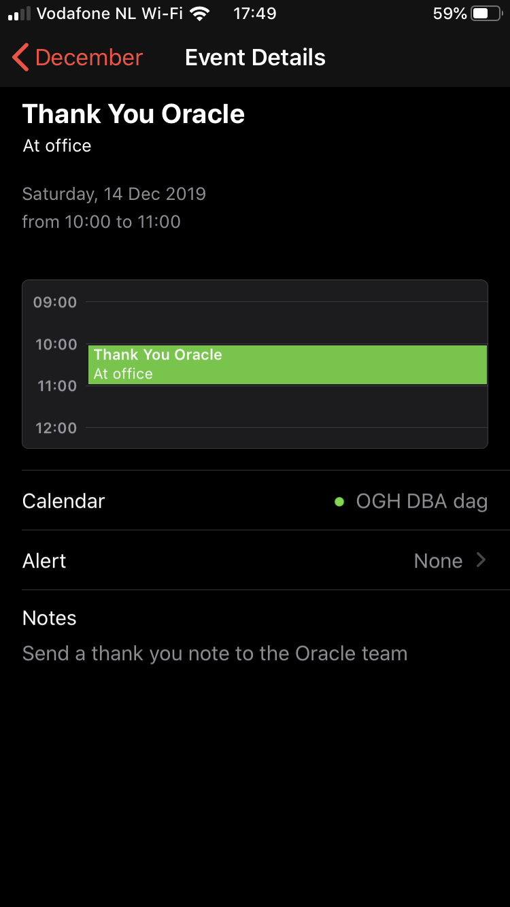
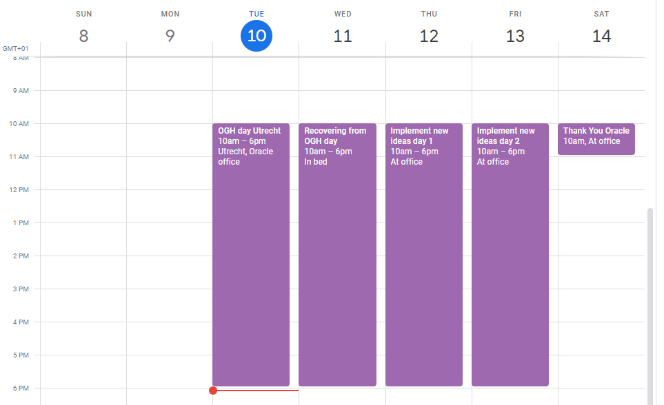

---

# Create .ics integration with your calendar data #
Having a database with interesting information like dates can be more useful if the data would be available on other devices as well. In this lab we will demonstrate how easy it is to export calendar information from Oracle Autonomous Database to devices and applications like your phone, Thunderbird/Lightning or other calendaring apps. The most often used and supported standard is the iCalendar standard (RFC5545 as [described here](https://tools.ietf.org/html/rfc5545)). This is a plain text file available over the network which can be imported (one-off) or subscribed to by applications.

In Oracle Autonomous Database, we can leverage the installed APEX environment. One of the default options in Autonomous Database is the enabled ORDS interface. Using this interface, we can create our own APIs to, for example, make the iCalendar files available to the users.

## Prerequisites ##

- Running Autonomous Database instance

## Prepare the APEX user and workspace ##
We are going to leverage the existing ORDS REST API interface in Autonomous Database. This can be done from SQL Developer but it is easier to do this from the installed APEX in ADB.

Log into Oracle Cloud and navigate to your Autonomous Database instance. The following screen should be visible:

Click on the 'Service Console' button. This will open another window that looks like this:

Click on the Development link on the left side of the screen. The following should be visible:

Click on the Oracle APEX link. This will navigate to the install APEX login page:

If this is the first time you start the APEX interface (and no workspaces have been created), use your admin password to login. The admin password was the password you used when creating the Autonomous Database.

Create new workspace with the following details:

- Database user: **DEMO**
- Password : **<your own password>**
- Workspace name: **DEMO**

Click on Create Workspace to continue. After the creation is successful, log out as ADMIN user and login to the workspace DEMO with the password you just supplied.

After logging in, we can first create a new table and procedure for the .ics integration.

## Create a table that contains our Calendar data ##
Since we do not have an existing application, we will create a dummy table that contains some data we can use. Navigate to the SQL Workshop section of APEX:

Start a SQL Commands window:

Copy the following code into your SQL Commands window and execute it:

    create table myCal (id          number,
                        date_start  date,
                        date_end    date,
                        title       varchar2(100),
                        desc_txt    varchar2(500),
                        location    varchar2(50)); 
    
After this, let's insert some data into this table to have something to display:

    declare
      l_date  date  := trunc(sysdate);
    begin
      insert into myCal (id, date_start, date_end, title, location, desc_txt) values (1, l_date+0+(9/24), l_date+0+(17/24), 'OGH day Utrecht', 'Utrecht, Oracle office', 'Today is the OGH day');
      insert into myCal (id, date_start, date_end, title, location, desc_txt) values (2, l_date+1+(9/24), l_date+1+(17/24), 'Recovering from OGH day', 'In bed', 'yesterday was the OGH day');
      insert into myCal (id, date_start, date_end, title, location, desc_txt) values (3, l_date+2+(9/24), l_date+2+(17/24), 'Implement new ideas day 1', 'At office', 'Make use of what we learned at the OGH Day');
      insert into myCal (id, date_start, date_end, title, location, desc_txt) values (4, l_date+3+(9/24), l_date+3+(17/24), 'Implement new ideas day 2', 'At office', 'Make use of what we learned at the OGH Day');
      insert into myCal (id, date_start, date_end, title, location, desc_txt) values (5, l_date+4+(9/24), l_date+4+(10/24), 'Thank You Oracle', 'At office', 'Send a thank you note to the Oracle team');
    
      commit;
    end;

## Create procedure that generates .ics content ##

Next step is to create a procedure that generates the .ics content. We can then make the output of this procedure available for our end-users.

Copy the following code into your SQL Commands sheet and execute it.

    create or replace procedure ICS_CALENDAR as

      cursor c_mycal is select id, date_start, date_end, title, desc_txt, location
                        from myCal;
    
    BEGIN
    
      OWA_UTIL.mime_header('text/calendar', FALSE);
      OWA_UTIL.http_header_close;
    
      -- Generic information
      htp.print('BEGIN:VCALENDAR');
      htp.print('X-WR-CALNAME:Stivehu algemeen');
      htp.print('X-WR-CALDESC:OGH Demo Calendar');
      htp.print('X-PUBLISHED-TTL:PT15M');
      htp.print('PRODID:-//Robert Pastijn//Oracle ProdDev PTS//NL');
      htp.print('VERSION:2.0');
    
      -- Detailed info per event
      for x in c_mycal loop
        htp.print('BEGIN:VEVENT');
        htp.print('DTSTAMP:'||to_char(sysdate,'YYYYMMDD')||'T'||to_char(sysdate,'HH24MISS')||'Z');
        htp.print('UID:'||x.id||'@ogh.oraclepts.nl');
        htp.print('DTSTART;VALUE=DATE-TIME:'||to_char(x.date_start,'YYYYMMDD')||'T'||to_char(x.date_start,'HH24MISS')||'Z');
        htp.print('DTEND;VALUE=DATE-TIME:'||to_char(x.date_end  ,'YYYYMMDD')||'T'||to_char(x.date_end  ,'HH24MISS')||'Z');
        htp.print('SUMMARY:'||x.title);
        htp.print('LOCATION:'||x.location);
        htp.print('TRANSP:TRANSPARENT');
        htp.print('DESCRIPTION: '||x.desc_txt);
        htp.print('END:VEVENT');
      end loop;
    
      htp.print('END:VCALENDAR');
    end;

We can now check if our procedure actually produces information by simply executing it:

    begin
      ics_calendar;
    end;

It should produce an output similar to the following:

    Content-type: text/calendar; charset=UTF-8
    
    BEGIN:VCALENDAR
    X-WR-CALNAME:OGH DBA Dag
    X-WR-CALDESC:OGH Demo Calendar
    X-PUBLISHED-TTL:PT15M
    PRODID:-//Robert Pastijn//Oracle ProdDev PTS//NL
    VERSION:2.0
    BEGIN:VEVENT
    DTSTAMP:20191210T160920Z
    UID:1@ogh.oraclepts.nl
    DTSTART;VALUE=DATE-TIME:20191210T090000Z
    DTEND;VALUE=DATE-TIME:20191210T170000Z
    SUMMARY:OGH day Utrecht
    LOCATION:Utrecht, Oracle office
    TRANSP:TRANSPARENT
    DESCRIPTION: Today is the OGH day
    END:VEVENT
    (etc etc)
    
This would be enough for our environment. We can now publish the information using the rest api options.

## Enable a REST API call for our procedure ##

Navigate to the RESTful Services option in the SQL Workshop menu:

If this is the first time doing anything with RESTful services from this schema, you need to register your schema to ORDS:

Click the 'Register Schema with ORDS' to continue.

Accept the default and register the schema to ORDS. We can now create our own module and methods for our schema. By accepting the defaults in the previous windows, a demo module has been installed. However, we will create a new module.

On the left side of the screen, click on the Modules node. After landing on the ORDS RESTful Modules page, click on 'Create Module':

Enter the following values:

- Module Name: **calendar**
- Base Path: **calendar**
- Is Published: **Yes**
- Pagination Size: **25**
- Origins Allowed: **<keep\_empty>**
- Comments: **<Whatever you feel like entering\>**

Click on Create Module again to submit the data. After clicking on the Create Module, the screen is refreshed, a section for 'Resource Templates' is added and a URL is displayed:

We are almost done. We now need to add a 'Resource Template'. Click on the 'Create Template' button:

Enter the following values in the fields:

- URI Template: **demo**
- Priority: **0**
- HTTP Entity Tag Type: **None**
- Comments: **<Whatever you feel like\>**

Click on the 'Create Template button'. This will refresh the screen, add a new section called 'Resource Handlers' and extent our URL with new information:

The 'Handler' is the final step in our setup. Create a new Handler for our REST Api by clicking on the 'Create Handler' button:

Enter the following values in the fields:

- Method: **GET**
- Source Type: **PL/SQL**
- Pagination Size: **<keep empty\>**
- Comments: **<Whatever you feel like\>**

In the Source section, enter the following code:

    begin
      ics_calendar;
    end;

Click on the 'Create Handler' button to continue. 

> **Hint:** when submitting the handler and the PL/SQL code, the PL/SQL part is not parsed and therefore will never display any errors. Only when you call the REST Api will it parse the code. That is when you will see any errors with the code. It is best to first test the code, like we did, before using it inside a handler. It is therefore also good practice to keep the code in the handler to a minimum as debugging will take much more effort.

The handler should now display the following page

We are ready to execute the REST API call.

## Testing the REST API call ##

On the Handler screen, the system has printed the full URL we need to use for our REST API. Since we did nothing with authentication, we should be able to take the URL and run it inside a browser.

Copy the URL and paste it inside a browser.

Depending on your system, the client can do several things. In my laptop, it started Outlook 2016 so that it can add the .ics file to my calendar.

## Adding the .ics file to your iPhone calendar ##

Subscribing to a .ics file in an iPhone can be done from the phone itself. Take the following navigation steps:

- Settings
- Passwords and Accounts
- Add Account
- Other
- Add Subscribed Calendar

Under the 'Server' option, paste the URL from the APEX page and press Next

> **Hint:** there are several ways to get the URL on your phone. You can either type it into your phone, send yourself an email, create a textdocument and save it on a shared folder.

If all goes well, you will now see the calendar items in your calendar. This is what it looked like before the .ics was added:

This is what it looks like after the .ics file was added:

## Adding the .ics file to your Android phone ##

Simply double-clicking on a .ics file in an Android phone will add the .ics events to your calendar but the values will not refresh automatically. This is because the clicking only imported the values but not subscribed to any changes.
Unfortunately subscribing to a .ics calendar on the internet can only be done from a webbrowser in the full Google Calendar website.

Log into the [Google Calendar Website](https://calendar.google.com) with the same username and password as you use on your phone:

Add a new 'Other Calendar' by clicking on the Plus (+) link on the right of the 'Other Calendars' section and selecting 'From URL'. Paste the URL for our REST API into the URL field:

After adding the new calendar subscription, you can return to your Calendar screen. The entries will be visible. After the next refresh, the items will be visible on your phone as well.

## End-of-Lab ##

