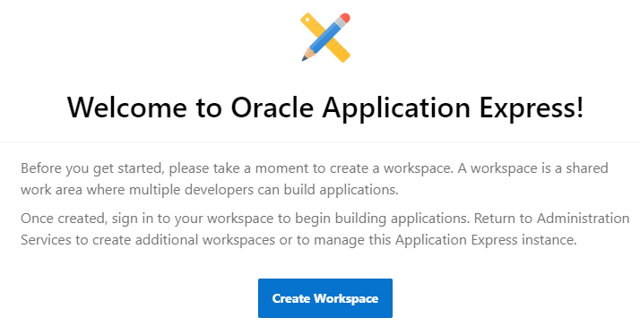
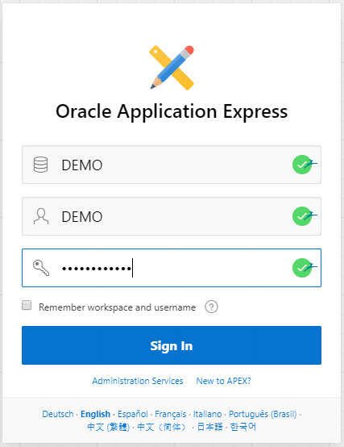
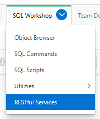
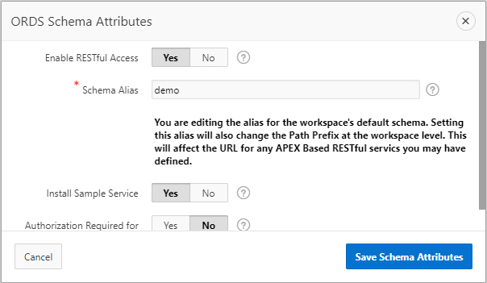
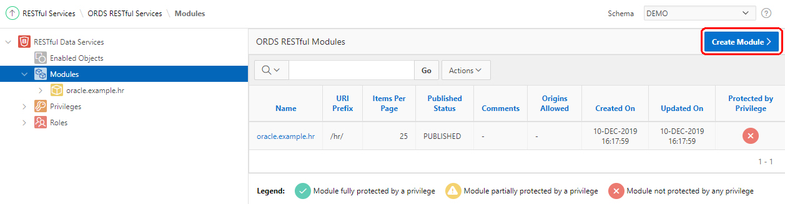

# Make Siri interact with Autonomous Database (iPhone owners only) #
Having a database with interesting information can be more useful if the data would be available on other devices as well. In this lab we will demonstrate how easy it is link information from the database and make it available to assistants like Apple's Siri. In Oracle Autonomous Database, we can leverage the installed APEX environment. One of the default options in Autonomous Database is the enabled ORDS interface. Using this interface, we can create our own APIs to, for example, to receive information from Siri and send a response back.

## Prerequisites ##

- Running Autonomous Database instance

## Prepare the APEX user and workspace ##
We are going to leverage the existing ORDS REST API interface in Autonomous Database. This can be done from SQL Developer but it is easier to do this from the installed APEX in ADB.

Log into Oracle Cloud and navigate to your Autonomous Database instance. The following screen should be visible:

Click on the 'Service Console' button. This will open another window that looks like this:

Click on the Development link on the left side of the screen. The following should be visible:

Click on the Oracle APEX link. This will navigate to the install APEX login page:

If this is the first time you start the APEX interface (and no workspaces have been created), use your admin password to login. The admin password was the password you used when creating the Autonomous Database.

Create new workspace with the following details:

- Database user: **DEMO**
- Password : **<your own password>**
- Workspace name: **DEMO**

Click on Create Workspace to continue. After the creation is successful, log out as ADMIN user and login to the workspace DEMO with the password you just supplied.

After logging in, we can first create a new table and procedure for the .ics integration.

## Create procedure for Siri ##

Next step is to create a procedure that sends information to Siri. One of the easiest options is simply generate text which can be read out loud by the assistant.

Copy the following code into your SQL Commands sheet and execute it.

    create or replace procedure SIRI_TALKS as
   
    BEGIN
    
      htp.p('Hello World.');
    end;

We can now check if our procedure actually produces information by simply executing it:

    begin
      siri_talks;
    end;

It should produce an output similar to the following:

    Hello World.
    
This would be enough for an initial test. We can now publish the information using the rest api options.

## Enable a REST API call for our procedure ##

Navigate to the RESTful Services option in the SQL Workshop menu:

If this is the first time doing anything with RESTful services from this schema, you need to register your schema to ORDS:

Click the 'Register Schema with ORDS' to continue.

Accept the default and register the schema to ORDS. We can now create our own module and methods for our schema. By accepting the defaults in the previous windows, a demo module has been installed. However, we will create a new module.

On the left side of the screen, click on the Modules node. After landing on the ORDS RESTful Modules page, click on 'Create Module':

Enter the following values:

- Module Name: **siri**
- Base Path: **siri**
- Is Published: **Yes**
- Pagination Size: **25**
- Origins Allowed: **<keep\_empty>**
- Comments: **<Whatever you feel like entering\>**

Click on Create Module again to submit the data. After clicking on the Create Module, the screen is refreshed, a section for 'Resource Templates' is added and a URL is displayed:

We now need to add a 'Resource Template'. Click on the 'Create Template' button:

Enter the following values in the fields:

- URI Template: **speaks**
- Priority: **0**
- HTTP Entity Tag Type: **None**
- Comments: **<Whatever you feel like\>**

Click on the 'Create Template button'. This will refresh the screen, add a new section called 'Resource Handlers' and extent our URL with new information:

The 'Handler' is the final step in our setup. Create a new Handler for our REST Api by clicking on the 'Create Handler' button:

Enter the following values in the fields:

- Method: **GET**
- Source Type: **PL/SQL**
- Pagination Size: **<keep empty\>**
- Comments: **<Whatever you feel like\>**

In the Source section, enter the following code:

    begin
      siri_talks;
    end;

Click on the 'Create Handler' button to continue. 

> **Hint:** when submitting the handler and the PL/SQL code, the PL/SQL part is not parsed and therefore will never display any errors. Only when you call the REST Api will it parse the code. That is when you will see any errors with the code. It is best to first test the code, like we did, before using it inside a handler. It is therefore also good practice to keep the code in the handler to a minimum as debugging will take much more effort.

The handler should now display the following page

We are ready to execute the REST API call.

## Testing the REST API call ##

On the Handler screen, the system has printed the full URL we need to use for our REST API. Since we did nothing with authentication, we should be able to take the URL and run it inside a browser.

Copy the URL and paste it inside a browser. When executed it should display our 'Hello World.' message.

## Making Siri respond ##

By default (for iOS 10 and up) the app 'Shortcuts' is available on the iPhone. In this app you can create shortcuts to (series of) steps you perform on your iPhone. We will use this functionality to make Siri respond to use.

> **Hint:** If you cannot find 'Shortcuts' on your iPhone, please download and install it from the Apple Itunes app store.

Start the shortcuts app:

The following screen (or similar) will be visible:

Click on the Plus (+) to create a new Shortcut:

Rename the Shortcut by clicking on the circle with the three dots. The title of the Shortcut is what Siri responds to. In our example we use 'My Siri Test'; if your phone is setup in another language, please use a short question in your own language.

After saving this new name, we can add actions for this Shortcut. Click on the Plus (+) sign on the screen and find 'Get Contents of URL' option in the search screen:

After adding, the action can be made more specific by changing the URL that the action needs to access. This URL is the REST API link that we created earlier in this lab. Enter the URL into the Siri shortcut:

It should look similar to this:

Last step is to make Siri speak the words out loud. This is a second action we will need in this Shortcut. Add a new action and find the 'Speak Text' action. After selecting it, the screen should look like this:

We are now ready to test. Click on Done to return to the main screen. The new action should now be visible:

The first time you access a shortcut, you need to permit the Shortcut to access the URL. To make it easier, simply tap on the Shortcut to start it for the first time. Accept the pop-up to allow Siri to continue:

After accepting it, you will see the result of the URL call on your screen. Siri will, if all went well, welcome the world (Hello World). 

This is the moment where you can start using Siri. Start Siri (either by saying Hey Siri or by pressing your homebutton for 2 seconds) and asking Siri 'My Siri Test' (or whatever title you gave to the Shortcut). After a few moments you should hear Siri respond.

## Making things more dynamic ##

By simply changing the result of the PL/SQL procedure the functionality of the REST API call, and therefore Siri's answer, will change.

Execute the following code and ask Siri again. She will now respond with the current date and time:

    create or replace procedure SIRI_TALKS as
    
      l_result  varchar2(2000);
       
    BEGIN
    
      l_result := 'It is today '||
                  to_char(sysdate,'Day Month DD YYYY')||
                  ' at '||
                  to_char(sysdate,'HH MI AM')||'.';
    
      htp.p(l_result);
    end;

Please see the documentation on how to receive query parameters and header parameters in ORDS REST API calls. This can be used for sending additional information to the REST API from the calling function.

## End-of-Lab ##